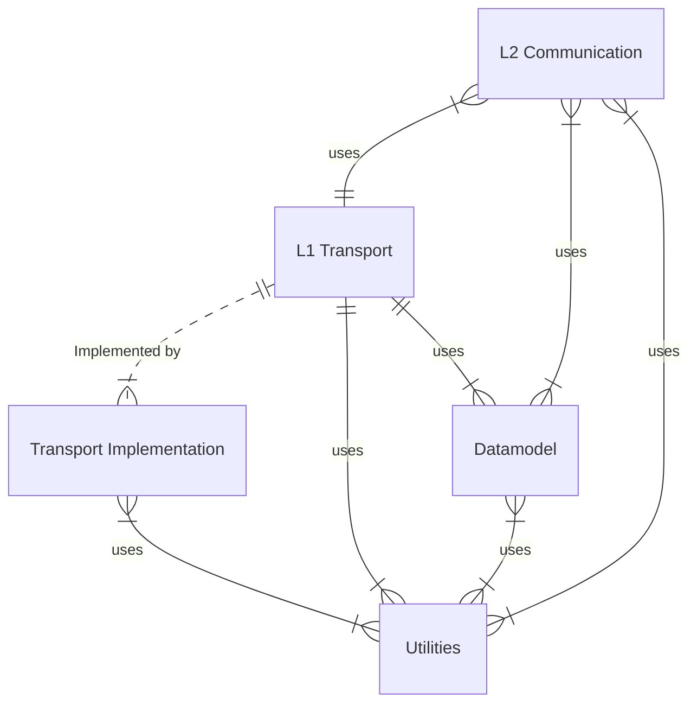
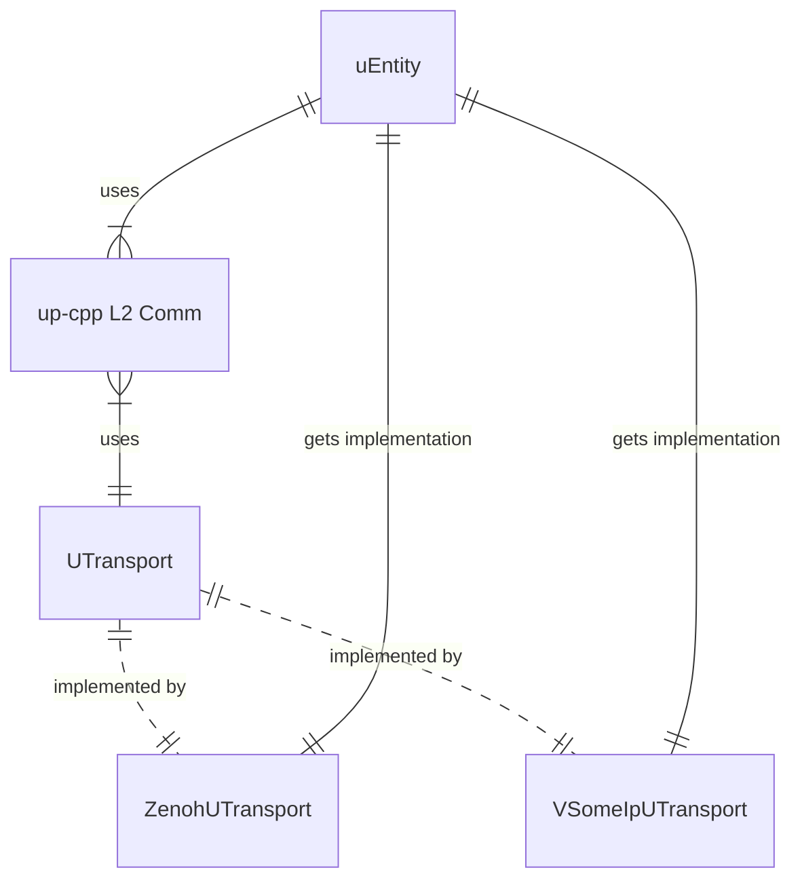

# Design notes for up-cpp

up-cpp provides a common interface for building uProtocol applications
(uEntities or uE) in C++. This library is composed of layers, each one building
on the one before:

* Common utilities (`up-cpp/utils/`)
* Datamodel operations (`up-cpp/datamodel/`)
  * Builders (`up-cpp/datamodel/builder/`)
  * Serializers (`up-cpp/datamodel/serializer/`)
  * Validators (`up-cpp/datamodel/validator/`)
* L1 Transport (`up-cpp/transport/`)
* L2 Communications (`up-cpp/communications`)

Most uE will operate at _Layer 2_, which provides interfaces for common
communications models, such as pub/sub, notficiations, and RPC. This
communications layer is composed of calls to _Layer 1_ for transport operations
such as sending and listening for messages. Note: In some limited cases,
specialized uE may operate directly on the transport layer. uStreamer, for
example, would be one such entity.

_Layer 1_ transport is exposed as a single virtual `UTransport` interface,
allowing for transport-independent at layers above this point. The actual
transport implementations are provided as separate libraries (e.g.
[up-client-zenoh-cpp](/eclipse-uprotocol/up-client-zenoh-cpp)).

The _Datamodel_ layer (sometimes called "Layer 0") is made up of protobuf
message objects, defined by the [uProtocol Specification](/eclipse-uprotocol/up-spec),
and tools for creating, validating, and serializing these objects.

Finally, the _Utilities_ layer contains common objects and functions shared
across up-cpp and transport implementations. Examples include objects for
callback management (`CallbackConnection.h`), thread pools (`ThreadPool.h`),
and more (`base64.h`).

## Classes and interfaces of up-cpp

High level:

uE using up-cpp (and a transport)

