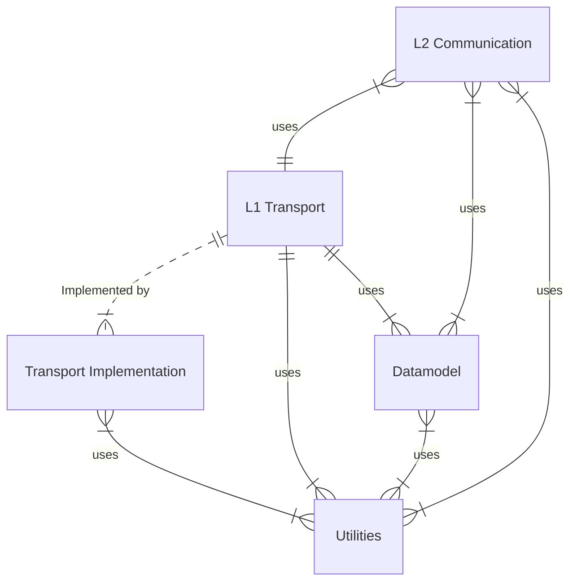
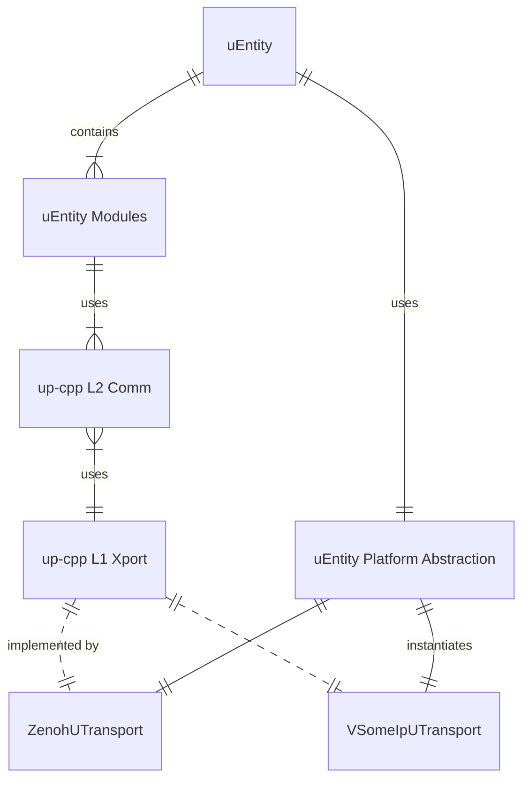
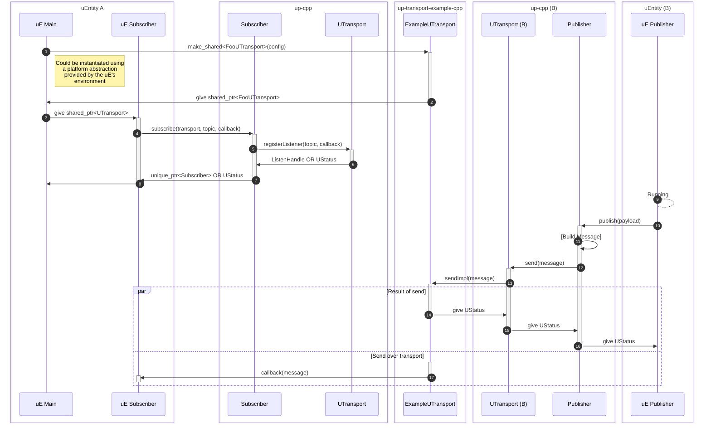

# Design notes for up-cpp

up-cpp provides a common interface for building uProtocol applications
(uEntities or uE) in C++. This library is composed of layers, each one building
on the one before:

* Common utilities (`up-cpp/utils/`)
* Datamodel operations (`up-cpp/datamodel/`)
  * Builders (`up-cpp/datamodel/builder/`)
  * Serializers (`up-cpp/datamodel/serializer/`)
  * Validators (`up-cpp/datamodel/validator/`)
* L1 Transport (`up-cpp/transport/`)
* L2 Communications (`up-cpp/communications`)

Most uE will operate at _Layer 2_, which provides interfaces for common
communications models, such as pub/sub, notficiations, and RPC. This
communications layer is composed of calls to _Layer 1_ for transport operations
such as sending and listening for messages. Note: In some limited cases,
specialized uE may operate directly on the transport layer. uStreamer, for
example, would be one such entity.

_Layer 1_ transport is exposed as a single virtual `UTransport` interface,
allowing for transport-independent at layers above this point. The actual
transport implementations are provided as separate libraries (e.g.
[up-client-zenoh-cpp](/eclipse-uprotocol/up-client-zenoh-cpp)).

The _Datamodel_ layer (sometimes called "Layer 0") is made up of protobuf
message objects, defined by the [uProtocol Specification](/eclipse-uprotocol/up-spec),
and tools for creating, validating, and serializing these objects.

Finally, the _Utilities_ layer contains common objects and functions shared
across up-cpp and transport implementations. Examples include objects for
callback management (`CallbackConnection.h`), thread pools (`ThreadPool.h`),
and more (`base64.h`).

## Interaction model for uEntities

A uEntity is an application or system component that communicates over
uProtocol. These uE may be composed of multiple modules, each of which could
operate on the interfaces of up-cpp (typically at _communication Layer 2_).

The uE is responsible for providing a `std::shared_ptr<UTransport>` to each
_Layer 2_ object instantiated, potentially through some platform abstraction
provided by the uE's platform ecosystem.

up-cpp is responsible for providing **something about validation and protocol
compliance, with the best results from using L2**.

## Example interactions

### Publisher / Subscriber

### RPC Client / Server

### Error handling and propagation

See [Error propagation model for up-cpp and related libraries](./error_propagation.md).

## Classes and interfaces of up-cpp

High level:

## Threading and synchronization model of up-cpp

**TODO: Any L1 or L2 interface can and will be called by multiple threads. They
must be thread safe**

**TODO: Should the base UTransport have a thread pool for servicing callbacks?
It doesn't seem like a good idea to rely on the transport implementations to
handle that. Most likely, one thread pool per UTransport is adequate to handle
the callbacks.**

**TODO: Any standard container will need to be mutex guarded. Recommend a
shared_lock for read-heavy containers. Recommend SafeMap model for associative
containers**

**TODO: All registered callbacks need to be thread safe. They could be invoked
multiple times simultaneously from different execution contexts. Hmm... is this
really the reqirement we want to impose? Is there another way to serialize
the requests (possibly through the connection objects?) without hogging all
the pool resources?**

_Possibly defer some design to the individual communication modules, looking
only at their operation modes. Maybe UTransport shouldn't have any sort of
thread pool_

## Error handling and propagation

See [Error propagation model for up-cpp and related libraries](./error_propagation.md).
