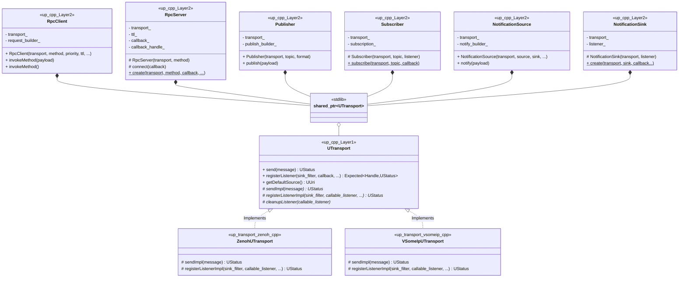
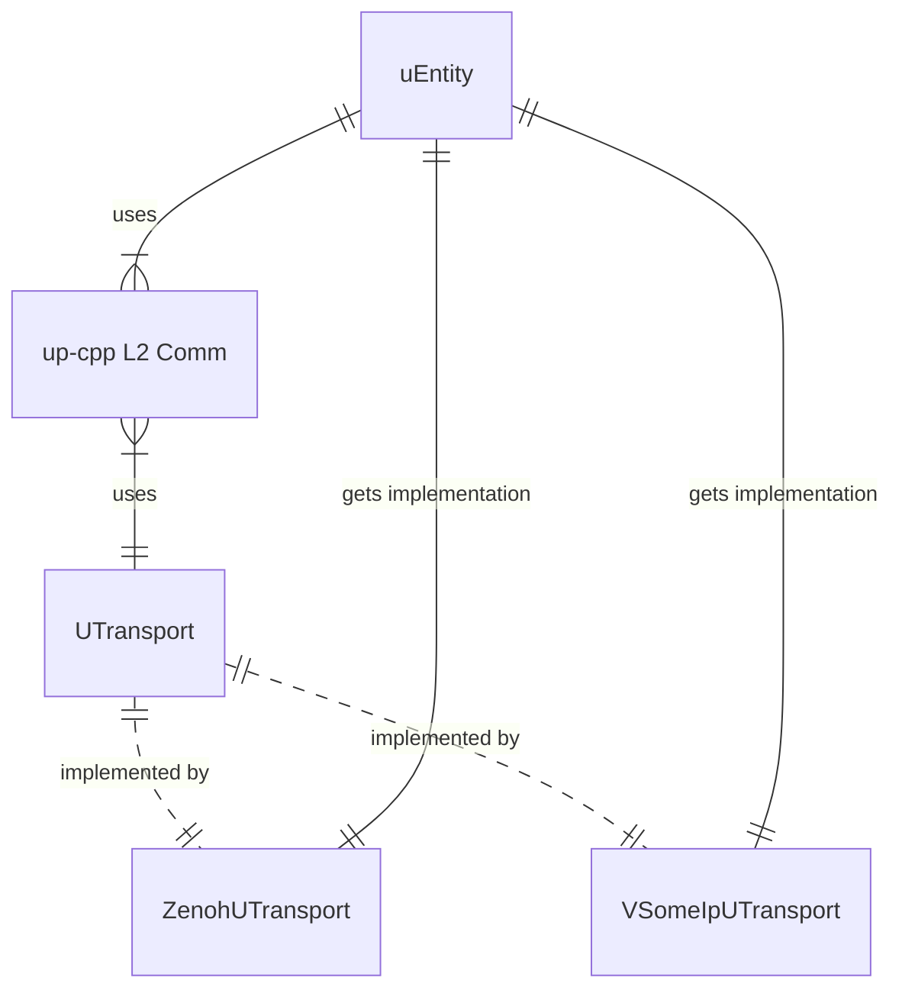

# Design notes for up-cpp

up-cpp provides a common interface for building uProtocol applications
(uEntities or uE) in C++.

Components:

* Datamodel operations (`up-cpp/datamodel/`)
  * Builders
  * Serializers
  * Validators
* L1 Transport (`up-cpp/transport/`)
* L2 Communications (`up-cpp/communications`)
* Common utilities (`up-cpp/utils/`)

For the vast majority of uE, the _L2 Communications_ modules will be the
primary point of interaction. Transport implementations (e.g.
[up-client-zenoh-cpp](/eclipse-uprotocol/up-client-zenoh-cpp)), on the other
hand, will be responsible for implementing the virtual interfaces found in
_L1 Transport_.

# Overview

High level:

uE using up-cpp (and a transport)

